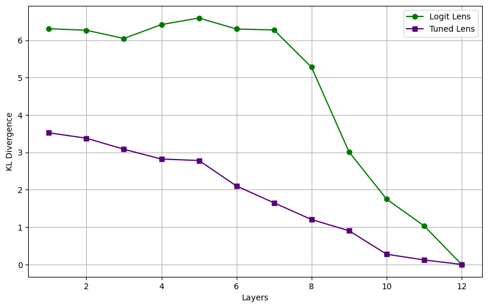
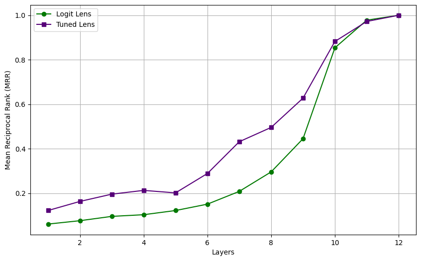
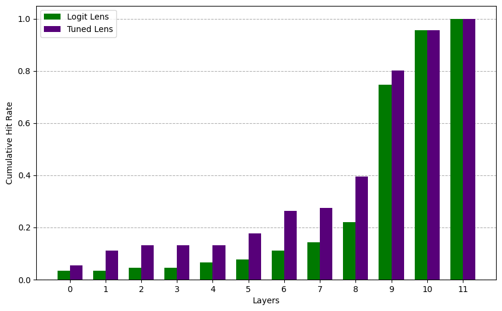
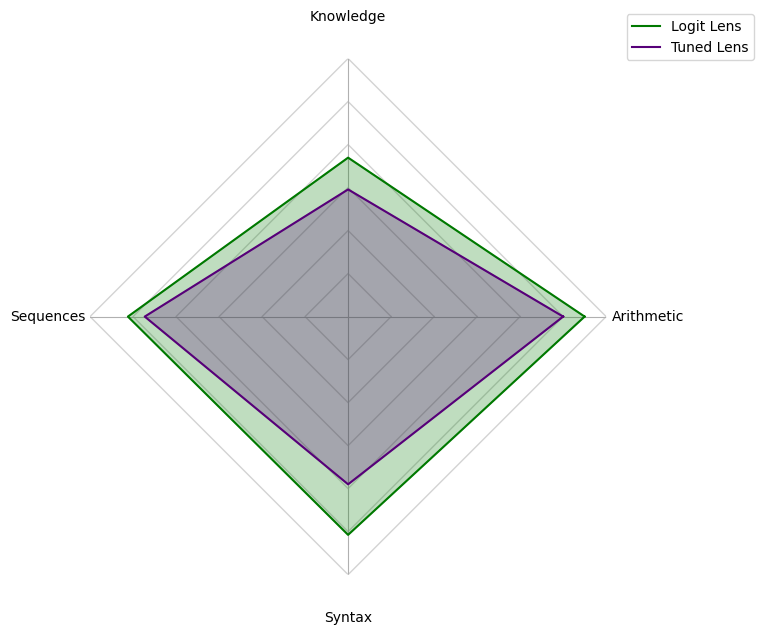

# Logit Lens vs. Tuned Lens: A Comparative Analysis of the Interpretability of Language Models

**Author:** Jacobo Chalarca Vásquez ([@jakomycat](https://github.com/jakomycat))  

  

## Abstract

The internal mechanisms of Large Language Models (LLMs) remain largely opaque, posing significant challenges for model interpretability. While techniques like the Logit Lens allow probing of intermediate Transformer layers, they suffer from representational mismatch, leading to noisy and inaccurate predictions in the early stages of the network. The Tuned Lens addresses this limitation by learning layer-specific affine transformations to align intermediate states with the final vocabulary space. This project presents a comprehensive comparative analysis of both techniques applied to the GPT-2 Small architecture. Using a categorized benchmark of prompts, we evaluate their performance across multiple metrics, including Kullback-Leibler Divergence, Mean Reciprocal Rank (MRR), Cumulative Hit Rate (CHR), and Average First Correct Layer (AFCL). Our empirical findings demonstrate that the Tuned Lens significantly outperforms the Logit Lens baseline, successfully decoding accurate predictions much earlier in the network. Furthermore, our analysis reveals distinct layer-wise processing dynamics based on task complexity, showing that factual knowledge consolidates in earlier layers compared to arithmetic reasoning.

## 1. Introduction

In the field of Large Language Models (LLMs), increasingly powerful models are emerging, such as GPT, Llama, Gemini, Claude, and others. The problem with these models is that we don’t know how they work internally, which leads to issues with security and debugging. This is where MI (Mechanistic Interpretability) comes in, which aims to solve the problem of models being black boxes.

Due to the way transformers work, the output layer can only be interpreted using an unembedding matrix applied to the output of the last layer. This means that the intermediate layers are completely unreadable at a glance.

To address this issue, the **Logit Lens** technique was developed, which involves capturing the outputs of the transformer’s intermediate layers and applying the Layer Norm of the final layer along with an unembedding matrix (nostalgebraist, 2020). This approach allows us to view the model’s predictions at a specific layer. This technique assumes that all layers are in the same representation space as the final layer, which is generally not true, resulting in noise in the early stages of the network.

To solve the problem of noise in the early layers, Belrose et al. (2023) proposed **Tuned Lens**, which consists of projecting the intermediate layers so that they resemble the output layer’s space as closely as possible, using a specific tuning transformation for each layer.

The purpose of the project is to assess, using various metrics—some of which were not used in the original works—whether Tuned Lens truly offers an advantage over Logit Lens.


## 2. Project Methodology and Architecture

### 2.1. Model and Data Configuration

The code is designed to work specifically with GPT-2 small; it has not been tested with other models. However, there are plans to expand the code in the future to work with different models. The model used has twelve hidden layers ($L = 12$).

To perform the comparative analysis, which is explained in more detail in Section 3, we use a set of prompts generated with Gemini 3.1 Pro, which are stored in `prompts_benchmark.txt`. These prompts are divided into four categories: knowledge, arithmetic, sequences, and syntax.

The WikiText-2 dataset was used to train the weights for use Tuned Lens, given the limited resources available for the project.

### 2.2. Extracting Hidden States

The `transformers` library from Hugging Face allows us to import various models; when importing them, we can enable an option to store the $h_l$ representations for each layer $l$ during the forward pass.

### 2.3. Implementation of Logit Lens

The idea is to extract the unembedding matrix $W_U$ from the model’s final layer, which is responsible for transforming our raw data into logits over the vocabulary. We then apply this matrix to the hidden states $h_l$, followed by a softmax to obtain the vocabulary probabilities at that layer $l$. Mathematically, this looks like this:

$$
p_l = \text{softmax}(W_U \cdot \text{LayerNorm}(h_l)).
$$

This technique assumes that all layers are in the same feature space as the output. This problem leads us to the next subsection.

### 2.4. Implementation of Tuned Lens

In the previous subsection, we explained the main problem with Logit Lens: it proposed applying a linear transformation to $h_l$ to bring it as close as possible to the feature space of the final layer:

$$
\~{h}_{l} = A_l h_{l} + b_l,
$$

where $A_l$ and $b_l$ are learnable parameters. Training is based on minimizing the cost function given by the Kullback-Leibler divergence:

$$
\mathcal{L} = D_{\text{KL}}(P_L \parallel P_l).
$$

The weights generated in `checkpoints/` were trained for $2$ epochs, with a batch size of $8$, a learning rate of $10^{-3}$, and the AdamW optimizer.


## 3. Preliminary Results

To analyze these two techniques and compare them, two notebooks were created to showcase the code used along with more technical explanations of their mathematical formulation; these can be found in `notebooks/`.

The first notebook provides a more detailed explanation of Logit Lens and Tuned Lens, along with code that allows each technique to be run. Additionally, a brief comparative analysis was conducted between the two using the prompt *The sky is usually*, which makes it easy to visually understand what each technique does.

The second notebook performs a comparative analysis using different metrics to determine which technique is better. Furthermore, as explained in section `2.1`, the prompts in `prompts_benchmark.txt` are used; these are filtered to select only those prompts whose target exactly matches the model’s prediction. For more details, see the explanation in the notebook’s `Data Extraction` section.

The results obtained from the comparative analysis described above are presented below.

### 3.1. Kullback-Leibler Divergence

The Kullback-Leibler divergence allows us to analyze how similar two probability distributions are; in this case, we analyze how similar the output distribution is to the distribution of layer $l$ under consideration. Mathematically, it is calculated as follows:

$$
D_{\text{KL}}(P \parallel Q) = \sum_i P(i) \ln{\frac{P(i)}{Q(i)}}.
$$

In **Figure 1**, you can see that when using Tuned Lens, the distributions of the intermediate layers are more similar to the distribution of the final layer compared to Logit Lens. If we had the necessary resources to train the lenses more powerfully, to bring the representations as close as possible to the final layer, we would obtain even lower values for Tuned Lens.

<div align="center">
  
  <p><i>Figure 1: Average KL divergence value for each layer of the model.</i></p>
</div>

### 3.2. Mean Reciprocal Rank

The mean reciprocal rank allows us to see which technique manages to place the correct prediction among the top probable tokens; this metric is calculated as follows:

$$
\text{MRR} = \frac{1}{N} \sum_{i=1}^{N} \frac{1}{\text{rank}_i}.
$$

It can be observed that this metric heavily penalizes the top positions; for example, being in the top 1 yields $\text{RR} = 1$ and being in the top 2 yields $\text{RR} = 0.5$, whereas lower positions are not penalized in the same way.

With this observation in mind, we can see in **Figure 2** that Tuned Lens achieves an MRR of approximately $0.5$ in layer 10, whereas Logit Lens achieves an MRR of approximately $0.3$ in the same layer. Furthermore, we can see that Tuned Lens achieves a better MRR than Logit Lens in all layers except layer 11. 

<div align="center">
  
  <p><i>Figure 2: Mean Reciprocal Rank (MRR) comparison across the intermediate layers. Higher values indicate better predictive ranking for the correct token.</i></p>
</div>

### 3.3. Cumulative Hit Rate Across Layers

This metric involves counting how many prompts correctly predict the target token as we progress through the layers. More specifically, for each layer $l$, we count how many prompts manage to place the correct token in the top position of the ranking in any layer up to $l$. Mathematically, this is calculated as follows:

$$
\text{CHR}(l) = \frac{1}{N} \sum^{N}_{i=1}1 \left(\exists k \leq l \text{ such that } \hat{y}_i^{(k)}=y_i \right),
$$

where $N$ is the number of prompts, $y_i$ is the target token for prompt $i$, and $\hat{y}_i^{(k)}$ is the token predicted in the top position of the ranking in layer $l$ for prompt $i$.

**Figure 3** shows that between layers 2 and 4, the number of prompts that successfully predicted the target token does not increase. Furthermore, it can be observed that in layer 9 there is a significant increase in the number of correctly predicted target tokens. Finally, layers 11 and 12 are the only layers where Logit Lens matches Tuned Lens on this metric; in all other layers, Tuned Lens is clearly superior.

<div align="center">
  
  <p><i>Figure 3: Cumulative proportion of prompts with correct top-1 prediction across layers. Tuned Lens outperforms Logit Lens in earlier layers, with both methods reaching similar performance at the final layers.</i></p>
</div>

### 3.4. Average First Correct Layer Across Prompt Categories

As noted in Section `2.1`, the prompts used are divided into four categories. To conduct a comparative analysis of Tuned Lens versus Logit Lens—specifically to observe how they perform depending on the type of prompt—a metric was developed to measure the average layer at which the prompts correctly predict the target token. Mathematically, this is represented as follows:

$$
\text{AFCL} = \frac{1}{N} \sum^{N}_{i=1} l_i^*,
$$

where

$$
l_i^* = \min \\{ k \in \{1, 2, \ldots, L\} : \hat{y}_i^{(k)} = y_i \\}.
$$

Given how the metric was presented, the higher the average layer, the worse the performance. With this in mind, **Figure 4** shows that in the *Knowledge* category, the average layer at which the target token equals the predicted token is considerably lower than in the other categories; more specifically, using Tuned Lens, the average layer is 6, and with Logit Lens, it is 8. In contrast, the *Arithmetic* category is also the category with the highest average layer, with an approximate value of 10 for Tuned Lens and 11 for Logit Lens. 

Finally, it is evident that, regardless of the category, Tuned Lens outperforms Logit Lens, with the *Syntax* category being the most distinctive, where there is a difference of up to 2 layers between the two techniques.

<div align="center">
  
  <p><i>Figure 4: Average layer of first correct top-1 prediction across prompt categories. Radial distance indicates the layer, and concentric lines represent layers in increments of two (2, 4, 6, ...).</i></p>
</div>

### 3.5. Observations

Overall, it was evident that Tuned Lens significantly outperforms Logit Lens, based on all the metrics analyzed. It is worth noting that, due to resource constraints, the Tuned Lens models were not trained properly in this project; this suggests that they could perform even better than what is shown in this analysis.

**Figure 3** shows an interesting behavior in the transition from layer 8 to 9, where a significant increase—around $40\%$—in the $\text{CHR}$ metric can be observed. This may indicate that, in general, layer 9 plays an important role.

As an extension of this work, one could analyze which layer is the most important using a new metric; specifically, one could examine what happens in each of the prompt categories.

Another interesting pattern is seen in **Figure 4**, where the *Knowledge* category typically predicts the target token in early layers, unlike the *Arithmetic* category, where the target token is usually predicted in later layers. This suggests that certain types of tasks require more complex internal processing.

This opens up an interesting avenue for future work, focused on understanding how large language models internally process different types of tasks and at what stage the necessary information becomes available.

## 4. Reproducibility

To reproduce the results presented in this analysis without any issues, follow the steps below to set up the environment, train the Tuned Lens weights from scratch, and run the notebooks.

### 4.1. Prerequisites

* **Python:** Any version 3.11.x.
* **Hardware:** A CUDA-enabled GPU is highly recommended training the lenses efficiently. If you want to work with the weights you've already trained with, one CPU is enough.

### 4.2. Installation

Clone the repository and set up the virtual environment:
```bash
git clone [https://github.com/jakomycat/logit-lens-vs-tuned-lens.git](https://github.com/jakomycat/logit-lens-vs-tuned-lens.git)
cd logit-lens-vs-tuned-lens
python -m venv .venv
source .venv/bin/activate  # On Windows use: .venv\Scripts\activate
pip install -r requirements.txt
```

### 4.3. Training the Tuned Lens

The project already includes some pre-trained weights in `checkpoints/`. However, if you want to train these weights with different settings, you can do so by running the following script:
```bash
python train.py
```
The hyperparameters are configured directly in the script; in a future update, you will be able to change them directly from the terminal. It is recommended to modify `batch_size`, `epochs`, `learning_rate`, and `max_length` to avoid complications. Remember that the project has only been tested with the GPT-2 model.

### 4.4. Running the Evaluation

To reproduce the various graphs shown in Section `3` and the graphs for a single prompt:

1. Start Jupyter Notebook:
```bash
jupyter notebook
```
2. Navigate to the notebooks/ directory.

3. Open and run `lens_mechanics_and_intuition.ipynb` to see the theoretical breakdown and the visual comparison using the *"The sky is usually"* prompt.

4. Open and run `comparative_analysis.ipynb` to process the `prompts_benchmark.txt` file and generate the metric graphs.

## 5. References

1. **nostalgebraist** (2020). *interpreting GPT: the logit lens*. LessWrong. Recuperado de: [https://www.lesswrong.com/posts/AcKRB8wDpdaN6v6ru/interpreting-gpt-the-logit-lens](https://www.lesswrong.com/posts/AcKRB8wDpdaN6v6ru/interpreting-gpt-the-logit-lens)

2. **Belrose, S., Furman, Z., Smith, L., Halawi, C., McKinney, I., Mutters, T., ... & Steinhardt, J.** (2023). *Eliciting Latent Predictions from Transformers with the Tuned Lens*. arXiv preprint arXiv:2303.08112. Recuperado de: [https://arxiv.org/abs/2303.08112](https://arxiv.org/abs/2303.08112)
